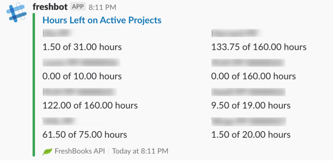

# Freshbot

Freshbot makes it easy to see how many hours your team has worked on active FreshBooks projects. It's a Slack bot that runs as an AWS Lambda function, making setup and maintenance easy.



## Getting Started

To set up your own Freshbot, you'll need to configure two services: AWS and Slack. To get started, follow the steps below.

### AWS Setup

#### Lambda

1) Create a new Lambda function and select Go 1.x as the language. Choose "Create new role from template(s)". Select the "KMS decryption permissions" policy template.
2) Set the "Handler" to be `freshbot`.
3) In the "Environment Variables" section for your function:
  * Create a KMS key, if you haven't already. The console will offer to create one for you if you check the "Enable helpers for encryption in transit" box. When asked to define key usage permissions, select the service role that you created in step (1). When you're finished, return to the page for your Lambda function. (If you want to use your own KMS key, visit the "Encryption Keys" section in IAM.)
  * Select the KMS key for encryption in transit.
  * Add your FreshBooks API key as `FBKS_API_KEY`. Encrypt it. If you want to verify the decryption code that's being used by this library, click the "Code" button to see the sample.
  * Add your organization's Freshbooks name as `FBKS_ORG_NAME`. For example, if your Freshbooks address is bitlancer.freshbooks.com, then your org name should be "bitlancer".
4) In the Basic Setting section, we recommend increasing the timeout value to 10 seconds. In most cases the response will be much faster than that, but it will provide a small buffer in case there are network or server issues.

#### API Gateway

1) Create a new API. The name, description, and endpoint type are up to you.
2) Using the "Actions" menu, create a new `POST` method. The integration type should be Lambda Function, and you must check "Use Lambda Proxy integration".
3) Select the Lambda function that you created in the Lambda section.
3) Using the "Actions" menu, deploy the API. You'll need to create a stage.
4) Take note of the "Invoke URL" that it gives you, as you'll need that in the next section.

### Slack Setup

1) Visit the [Slack Apps](https://api.slack.com/apps) page and click "Create New App".
2) Give the app a name and select your workspace. Click on "Slash Commands" on the next step, then "Create New Command".
3) The command can be anything you like, but the Request URL must be the Invoke URL that you got from API Gateway in step (4).
4) Navigate to the "Basic Information" page for your app and follow the instructions to install the app into your workspace.

For security reasons, we recommend adding an `FBKS_SLACK_VERIFICATION_TOKEN` environment variable to your Lambda function and using the verification token that Slack displays on your app's basic information page. If that variable is present, then Freshbot will refuse any requests that don't contain the token.

### Deploying

#### Official releases

See [releases](https://github.com/Bitlancer/freshbot/releases). Those packages can be uploaded directly to AWS Lambda.

#### Building from source

To build Freshbot, clone this repository and place it in your GOPATH. Then, to build it, run:

```
$ GOOS=linux go build
$ zip bundle.zip freshbot
```

There should now be a `bundle.zip` file. To deploy the bot, upload that bundle as your Lambda function package.

### Putting it All Together

At this point, your command should be available in Slack. Give it a try. If everything is configured correctly, then you should see a list of active FreshBooks projects and the number of hours remaining for each of them.
